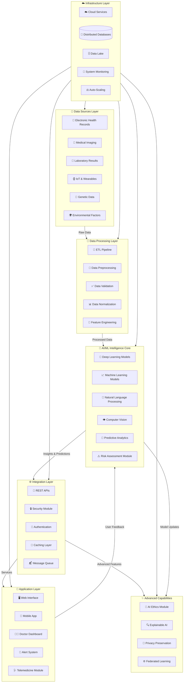

## AI/Healthcare System Architecture

```mermaid
flowchart TB
    %% Data Sources Layer
    subgraph DataSources["💾 Data Sources Layer"]
        EHR["🏥 Electronic Health Records"]
        IMG["📸 Medical Imaging"]
        LAB["🧪 Laboratory Results"]
        IOT["⌚ IoT & Wearables"]
        GEN["🧬 Genetic Data"]
        ENV["🌍 Environmental Factors"]
    end

    %% Data Processing Layer
    subgraph DataProcessing["🔄 Data Processing Layer"]
        ETL["🔀 ETL Pipeline"]
        PREP["🧹 Data Preprocessing"]
        VALID["✅ Data Validation"]
        NORM["📊 Data Normalization"]
        FE["🧩 Feature Engineering"]
    end

    %% AI/ML Core Layer
    subgraph AICore["🤖 AI/ML Intelligence Core"]
        DL["🧠 Deep Learning Models"]
        ML["📈 Machine Learning Models"]
        NLP["💬 Natural Language Processing"]
        CV["👁️ Computer Vision"]
        PRED["🔮 Predictive Analytics"]
        RISK["⚠️ Risk Assessment Module"]
    end

    %% Integration Layer
    subgraph Integration["🌐 Integration Layer"]
        API["🔗 REST APIs"]
        SEC["🔒 Security Module"]
        AUTH["🔑 Authentication"]
        CACHE["💨 Caching Layer"]
        MQ["📬 Message Queue"]
    end

    %% Application Layer
    subgraph Apps["📱 Application Layer"]
        WEB["🖥️ Web Interface"]
        MOB["📱 Mobile App"]
        DASH["👩‍⚕️ Doctor Dashboard"]
        ALERT["🚨 Alert System"]
        TELE["🩺 Telemedicine Module"]
    end

    %% Advanced Capabilities Layer
    subgraph Advanced["✨ Advanced Capabilities"]
        AI_ETH["🤝 AI Ethics Module"]
        EXPLAI["🔍 Explainable AI"]
        PRIVACY["🔐 Privacy Preservation"]
        FEDML["🌐 Federated Learning"]
    end

    %% Infrastructure Layer
    subgraph Infrastructure["☁️ Infrastructure Layer"]
        CLOUD["☁️ Cloud Services"]
        DB[("💽 Distributed Databases")]
        STORE["🗄️ Data Lake"]
        MONITOR["📡 System Monitoring"]
        SCALE["⚖️ Auto-Scaling"]
    end

    %% Data Flow and Connections
    DataSources --> |Raw Data| DataProcessing
    DataProcessing --> |Processed Data| AICore
    AICore --> |Insights & Predictions| Integration
    Integration --> |Services| Apps
    Integration --> |Advanced Features| Advanced
    
    %% Infrastructure Connections
    Infrastructure --> DataSources
    Infrastructure --> DataProcessing
    Infrastructure --> AICore
    Infrastructure --> Integration
    Infrastructure --> Apps
    Infrastructure --> Advanced

    %% Feedback and Continuous Learning
    Apps -->|User Feedback| AICore
    AICore -->|Model Updates| Advanced
```
